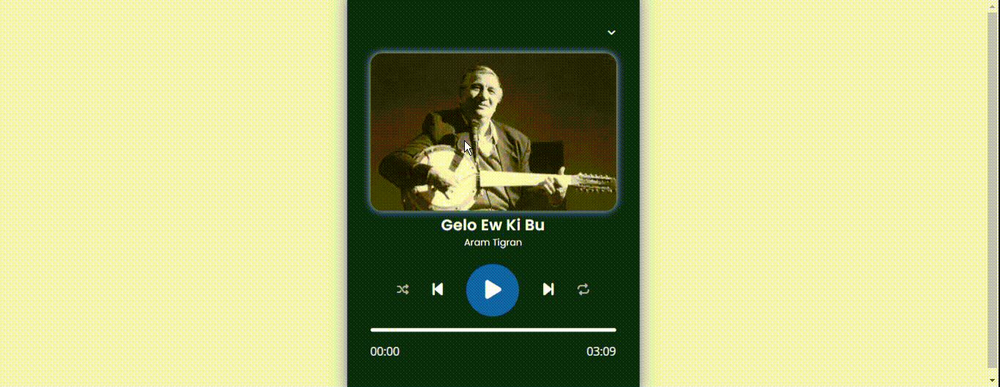

## jsMediaPlayer

-JavaScript ile html deki elementler alınıp hepsi birer değişkene atılıyor.

-Butonların olayları dinlenip ilgili fonksiyonlar click olayında çağırılıyor.

# JSMediaPlayer
# JS-Media-Player
# JS-Media-Player
# JS-Media-Player
